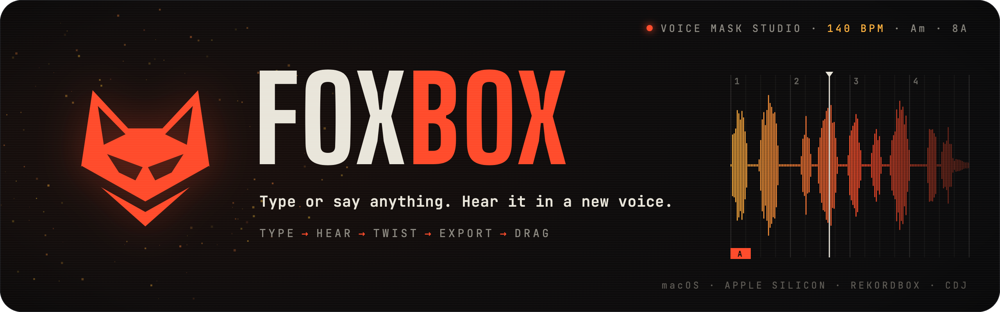
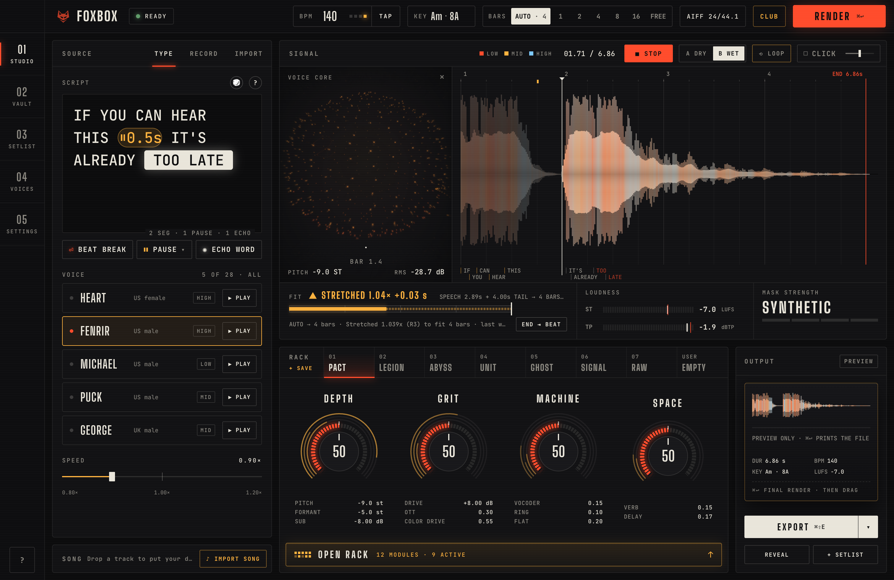
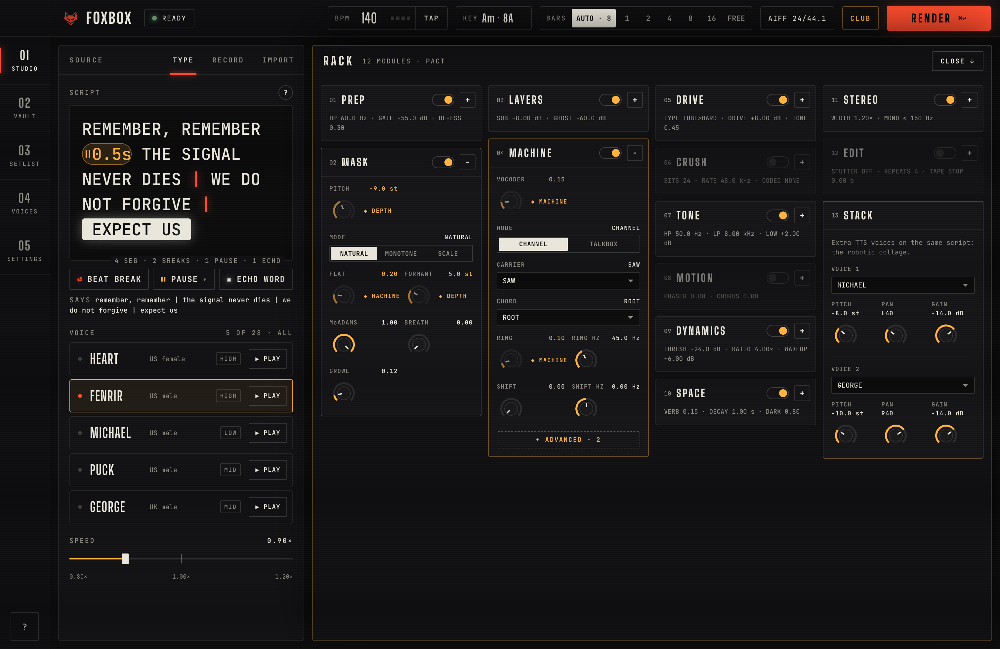
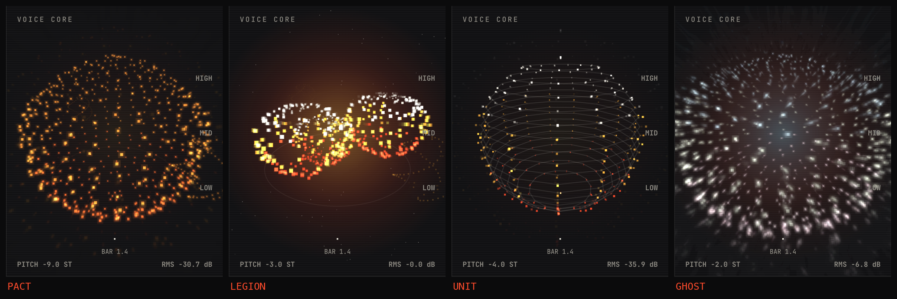
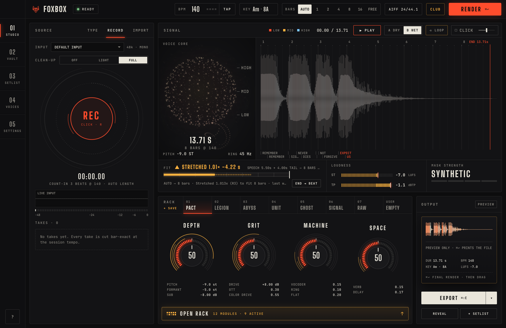
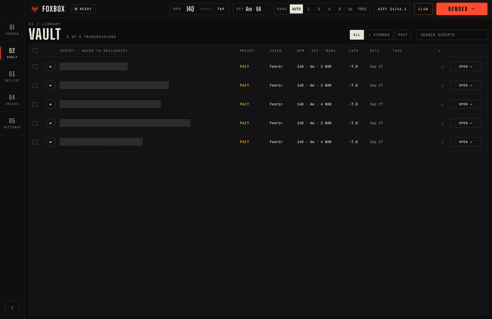
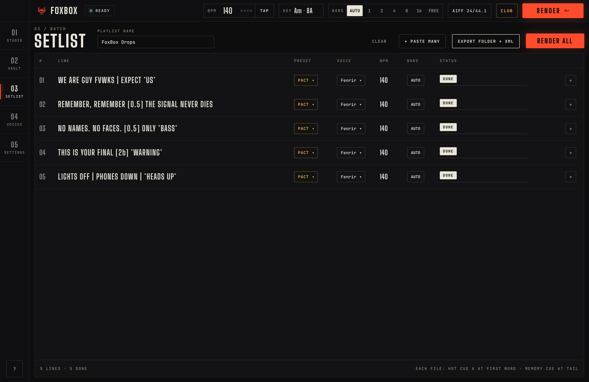
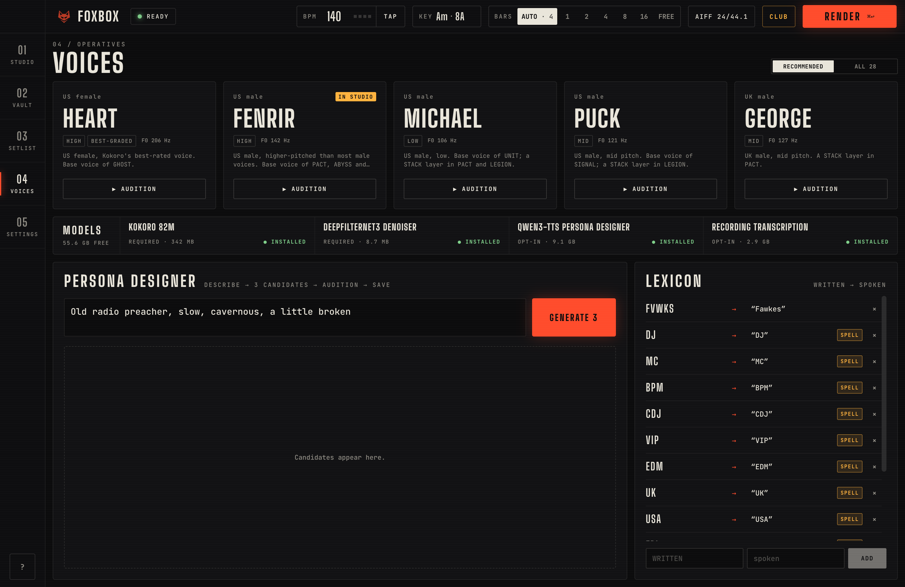
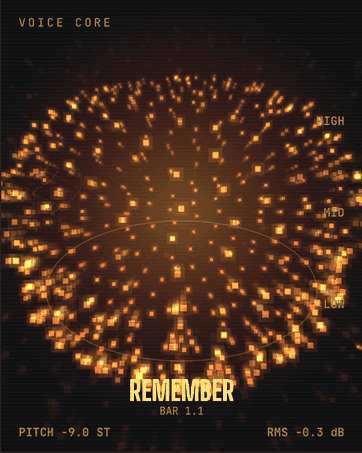
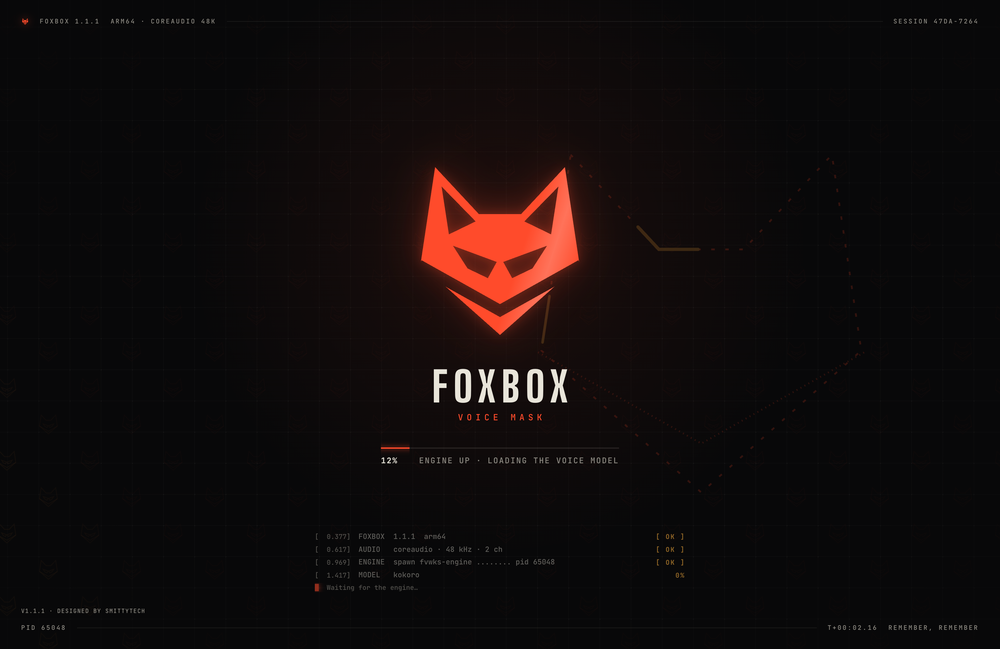

<div align="center">



<br/>

**A macOS voice-mask studio for DJs and producers.** Type a line or record your own voice. FoxBox turns it into
a low, distorted, anonymous transmission, then hands you a **bar-exact, club-loud drop** ready for Rekordbox, CDJs and your DAW.

[](https://github.com/als7294/FoxBox/releases/latest)


<br/>



<sub><b>STUDIO:</b> script on the left, the drop on a bar/beat grid in the middle, the voice core and rack on the right.</sub>

</div>

<br/>

## ⚡ From a typed line to a drop in 30 seconds

```text
  TYPE  ─▶  HEAR  ─▶  TWIST  ─▶  EXPORT  ─▶  DRAG
  script    instant   4 hero     AIFF/WAV    straight into
  or mic    preview   macros     + XML       Rekordbox / DAW
```

<table>
<tr>
<td width="50%" valign="top">

### 🎙 Voices
- **28 Kokoro TTS voices** running on the Apple GPU, faster than real time.
- **Persona designer** (optional): *describe* a voice ("deep gravelly broadcast") and reuse it on every line.
- **Your own voice:** record or import it. DeepFilterNet3 cleans it up, and Whisper transcribes it **word by word**.

</td>
<td width="50%" valign="top">

### 🎛 The rack
- Four hero macros: **DEPTH · GRIT · MACHINE · SPACE**.
- 12 modules behind them:
  - WORLD pitch/formant masking and a **robotic TTS collage**;
  - vocoder, **LPC talkbox** and ring mod;
  - **Airwindows** tape and tube, DeRez crush and **Galactic** reverb, plus OTT.

</td>
</tr>
<tr>
<td valign="top">

### 📐 Locked to the grid
- **AUTO bars** picks the length that fits.
- The phrase is **warped** so it starts on the downbeat and **lands on the beat**.
- Echo and reverb tails are **never cut**.
- A **CLICK** metronome to check the drop against the beat.

</td>
<td valign="top">

### 💿 Club-ready export
- **AIFF 44.1/24** with BPM and key tags.
- **CDJ-safe WAV**.
- Dry/wet variants and stems.
- A **rekordbox.xml** with beatgrid, **hot cue A on the first word** and a memory cue at voice-out.

</td>
</tr>
</table>

## 🖼 Tour

<table>
<tr>
<td width="50%"><br/><sub><b>OPEN RACK:</b> every module, bypassable, with 3–6 controls each</sub></td>
<td width="50%"><br/><sub><b>VOICE CORE:</b> a different motion for every preset, driven by the audio</sub></td>
</tr>
<tr>
<td><br/><sub><b>RECORD:</b> count-in, auto-clean, a word-level transcript you can edit</sub></td>
<td><br/><sub><b>VAULT:</b> every take, searchable and draggable, exportable as a Rekordbox playlist</sub></td>
</tr>
<tr>
<td><br/><sub><b>SETLIST:</b> paste many lines, render them all, export a folder plus XML</sub></td>
<td><br/><sub><b>VOICES:</b> auditions, the persona designer, a pronunciation lexicon and the models</sub></td>
</tr>
</table>

## 🔥 The voice core

<div align="center">


<sub>The voice core is driven by the render itself: loudness, pitch and each word's hit. Every preset moves differently.</sub>
</div>

## 🦊 Presets

| | Preset | Character |
|:-:|---|---|
| 🜂 | **PACT** | Deep entity: formant-dropped, sub-heavy, tape grit, a faint robotic collage, dark plate |
| 📡 | **LEGION** | An intercepted broadcast: a monotone chorus of voices, GSM radio, squelch |
| 🕳 | **ABYSS** | Pit-demon: growl, detuned doubles, tube drive, a huge dark hall |
| 🤖 | **UNIT** | Robot in key: a talkbox on the key root, ring mod, hard clip |
| 👻 | **GHOST** | Whisper transmission: a reverse swell into Galactic tails |
| ⚡ | **SIGNAL** | Glitch: DeRez crush, frequency shift, stutter, tape-stop |
| ◯ | **RAW** | An anonymizer base for your own voice |

Every preset is a starting point: the macros morph it. A **mask-strength badge** (SYNTHETIC · WEAK · MEDIUM · STRONG)
says plainly when a chain is only pitch-shifted, and so reversible.

## ✍️ Script markup

Use the insert buttons, or type the markup directly:

| Markup | Does |
|---|---|
| `\|` | **Beat break:** the next part starts on the next beat |
| `[0.5]` · `[2b]` | **Pause**, in seconds or beats |
| `*word*` | **Echo** throw on exactly that word |

```text
REMEMBER, REMEMBER [0.5] THE SIGNAL NEVER DIES | WE DO NOT FORGIVE | *EXPECT US*
```

## 📦 Install

> **Needs:** a Mac with Apple Silicon (M1 or newer), **macOS 14+**, about 2 GB free, and internet for the first launch.

1. Download **`FoxBox.dmg`** from [**Releases**](https://github.com/als7294/FoxBox/releases/latest) and drag **FoxBox** into Applications.
2. **First open only:** right-click FoxBox → **Open** → **Open**. The app isn't notarized by Apple yet.
3. **Setup** downloads the voices and the denoiser (about 350 MB) with live progress. The persona designer (about 9 GB) and transcripts (about 2.9 GB) are optional, now or later.
4. **Updates** arrive inside the app: FoxBox checks Releases, verifies the download and restarts into the new version.

<div align="center">

</div>

## 🧠 Under the hood

```
Electron app (React · TypeScript)      ── IPC proxy · vbx:// audio · drag-out · metronome · updater
        │   token-authenticated, loopback only
Python engine (FastAPI)                ── library (SQLite) · jobs · exports · rekordbox.xml
   ├── fvwks_voice      Kokoro-MLX · Qwen3-TTS persona · DeepFilterNet3 · Whisper + forced aligner
   ├── fvwks_fx         the rack: WORLD mask · layers · vocoder/talkbox · Airwindows · arrange · master
   └── fvwks_contracts  the shared models and seams every package agrees on
```

Everything runs **on your Mac**. No cloud, no account, and your voice never leaves the machine.

<details>
<summary><b>Develop</b></summary>

```bash
cd engine && uv sync --all-packages      # Python 3.12; compiles the small Airwindows module once
scripts/check.sh all                     # engine tests (contracts, voice, fx, server) + app tests
scripts/dev.sh                           # run the app against the local engine
```
</details>

## Credits

<div align="center">

**Designed by [SmittyTech](https://github.com/als7294)**

Built on open-source work by many people; see [THIRD_PARTY_NOTICES.md](THIRD_PARTY_NOTICES.md).
**The drops you make are yours.**

<sub>[GPL-3.0](LICENSE). FoxBox links GPL components (pedalboard, espeak-ng, mutagen), so the app is GPL-3.0 as a whole.
Model weights are downloaded at runtime under their own licenses.</sub>

</div>
