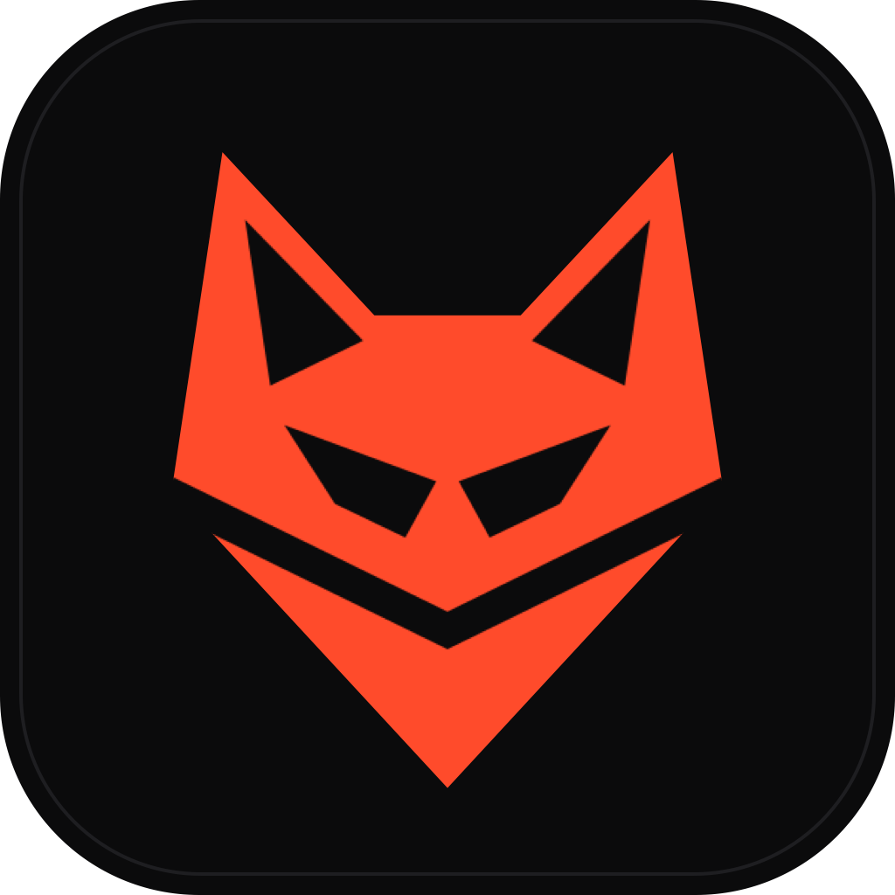

<div align="center">



# FoxBox

### Type or say anything. Hear it in a new voice.

A macOS voice-mask studio for DJs and producers. It turns typed text or your own voice into a low, distorted,
anonymous voice, then exports **bar-exact, club-loud drops** ready for Rekordbox, CDJs and your DAW.


</div>

---

## ◉ What it does

| | |
|---|---|
| **Voices** | Kokoro TTS on the Apple GPU (28 voices). An optional **persona designer**: describe a voice, reuse it everywhere. Or **record or import your own voice**, auto-cleaned with DeepFilterNet3 and transcribed word by word. |
| **The rack** | A 12-module effects chain driven by four hero knobs: **DEPTH · GRIT · MACHINE · SPACE**. WORLD-vocoder pitch/formant masking, sub and ghost layers, a **robotic TTS collage** (stacked voices aligned word by word), a channel vocoder and **LPC talkbox**, ring mod, **Airwindows** tape/tube colour, DeRez crush, Galactic reverb, OTT and more. |
| **The grid** | **AUTO bars** picks the length that fits. The phrase is warped so it starts on the downbeat and ends on the grid, with echo and reverb tails never cut. **Beat-Lock** puts each chunk on a beat, and `*echo*` throws hit exact words. |
| **The export** | 44.1 kHz / 24-bit AIFF with ID3 BPM/key tags, CDJ-safe WAV (PCM tag 1), dry/wet variants and stems, plus a **rekordbox.xml** with beatgrid, **hot cue A on the first word** and a memory cue at "voice out". Drag the cartridge straight into your DAW. |
| **Masking you can trust** | A mask-strength badge (SYNTHETIC / WEAK / MEDIUM / STRONG) says plainly when a chain is only pitch-shifted, and so reversible. |

## ◉ Presets
| Preset | Character |
|---|---|
| **PACT** | Deep entity: formant-dropped, sub-heavy, tape grit, faint robotic collage, dark plate |
| **LEGION** | An intercepted broadcast: a monotone chorus of voices, GSM radio, squelch |
| **ABYSS** | Pit-demon: growl, detuned doubles, tube drive, huge dark hall |
| **UNIT** | Robot in key: a talkbox on the key root, ring mod, hard clip |
| **GHOST** | Whisper transmission: reverse swell into Galactic tails |
| **SIGNAL** | Glitch: DeRez crush, frequency shift, stutter, tape-stop |
| **RAW** | An anonymizer base for your own voice |

Each preset is a starting point. The macros morph it, and the voice core in the Studio moves with every preset.

## ◉ Script markup
Use the insert buttons, or type the markup directly:

| Markup | Meaning |
|---|---|
| `\|` | Beat break: the next part starts on the next beat |
| `[0.5]` · `[2b]` | Pause, in seconds or beats |
| `*word*` | **Echo** throw on exactly that word |

```text
REMEMBER, REMEMBER [0.5] THE SIGNAL NEVER DIES | WE DO NOT FORGIVE | *EXPECT US*
```

## ◉ Install
1. Download the latest **`.dmg`** from Releases and drag **FoxBox** into Applications.
2. First launch opens **Setup**. It downloads the voices and the denoiser (about 350 MB, with live progress). You can add the persona designer (about 9 GB) and transcripts (about 2.9 GB) now or later.
3. Updates arrive inside the app.

## ◉ Architecture
```
Electron app (React · TypeScript)      ── IPC proxy · vbx:// audio · drag-out · metronome
        │   token-authenticated, loopback only
Python engine (FastAPI)                ── library (SQLite) · jobs · exports · rekordbox.xml
   ├── fvwks_voice   Kokoro-MLX · Qwen3-TTS persona · DeepFilterNet3 · Whisper + forced aligner
   ├── fvwks_fx      the rack: WORLD mask · layers · vocoder/talkbox · Airwindows · arrange · master
   └── fvwks_contracts   the frozen models and seams every package agrees on
```

## ◉ Develop
```bash
cd engine && uv sync --all-packages      # Python 3.12; compiles the small Airwindows module once
scripts/check.sh all                     # engine tests (contracts, voice, fx, server) + app tests
scripts/dev.sh                           # run the app against the local engine
```

## ◉ Credits
**Designed by [SmittyTech](https://github.com/als7294)**

Built on open-source work by many people; see [THIRD_PARTY_NOTICES.md](THIRD_PARTY_NOTICES.md).
The drops you make are yours.

## ◉ License
[GPL-3.0](LICENSE). FoxBox links GPL components (pedalboard, espeak-ng, mutagen), so the app is
GPL-3.0 as a whole. Model weights are downloaded at runtime under their own licenses, all of which allow commercial use.
