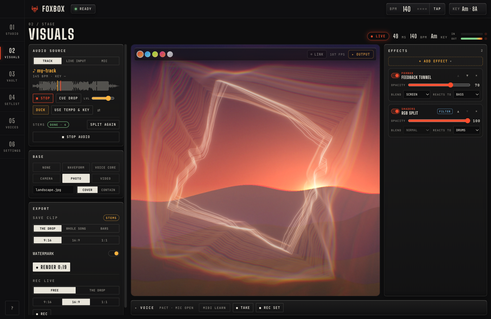
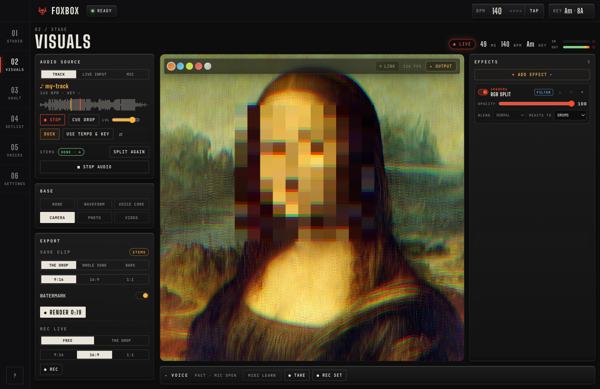
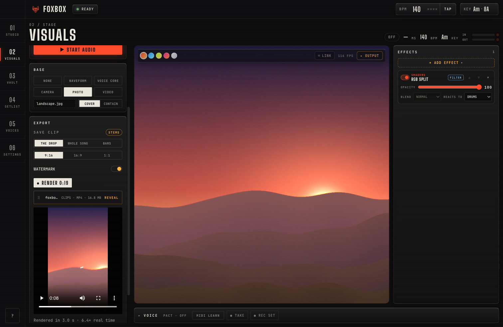
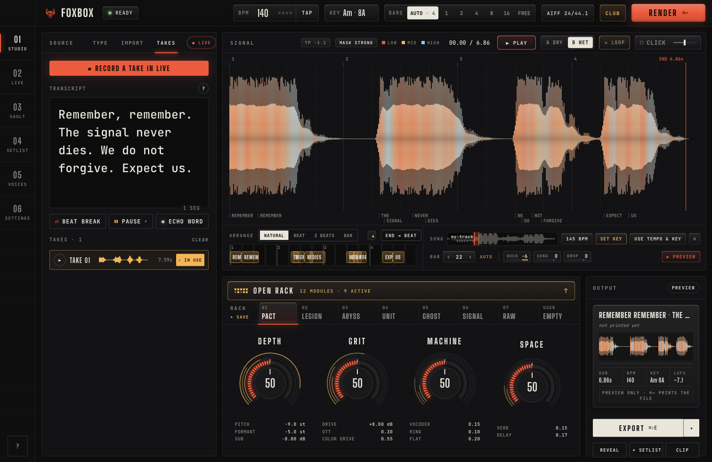

<div align="center">


<br/>

### Stay stealthy.

The voice-mask studio for bass music. Type a line or record your own. FoxBox masks it into a deep, distorted, anonymous voice, locks it to your grid,
and prints a **bar-exact, club-loud drop** for Rekordbox, CDJs and your DAW. Then turn your tracks into **stem-reactive visuals and
promo videos**, or run them live. It runs entirely on your Mac.

<br/>

[](https://github.com/als7294/FoxBox/releases/latest)


<br/>


</div>

<br/>

## How it works

```text
  TYPE / RECORD  ─▶  MASK  ─▶  LOCK TO GRID  ─▶  MASTER  ─▶  EXPORT / CLIP
  Kokoro TTS         12-module   AUTO bars,        −7 LUFS      AIFF + rekordbox.xml,
  or your own mic    FX rack     last word on      short-term,  or a face-masked
                                 the beat          −1 dBTP      video
```

<table>
<tr>
<td width="50%" valign="top">

### 🎙 Source
- **Kokoro-82M TTS** on the Apple GPU (MLX): 28 voices, faster than real time.
- **Record or import** your own voice. **DeepFilterNet3** cleans it, and **Whisper + a forced aligner** give word-level timing.
- **Persona designer** (optional, Qwen3-TTS): describe a voice once and reuse it on every line.
- **Markup** for timing: `|` beat break · `[0.5]` / `[2b]` pause · `*word*` echo throw.

</td>
<td width="50%" valign="top">

### 🎛 Mask
- **WORLD** vocoder resynthesis: pitch and formant moved **independently**, plus monotone and scale-lock.
- **Layers:** a sub octave, a ghost whisper, and a **stacked-voice robotic collage** aligned word by word.
- **Machine:** channel vocoder, **LPC talkbox** in key, ring mod, frequency shifter.
- **Colour:** Airwindows **ToTape9 / Tube2 / DeRez4 / Galactic3**, drive, crush, 3-band OTT.
- **Four macros:** DEPTH · GRIT · MACHINE · SPACE.

</td>
</tr>
<tr>
<td valign="top">

### 📐 Grid
- **Exact length:** 4 bars at 140 BPM is exactly 302,400 samples at 44.1 kHz.
- **AUTO bars** picks the length that fits the phrase and its FX tail.
- **END → BEAT / BAR:** the last word is warped onto the grid (Rubber Band R3, ≤ 8%).
- **Beat-Lock** puts every `|` chunk on a beat. Speech and tails are never cut.

</td>
<td valign="top">

### 💿 Master + export
- **CLUB:** −7 LUFS short-term max, true peak ≤ −1 dBTP. **BAKE-IN:** −6 dBFS peaks, no limiting.
- **AIFF 24-bit / 44.1 kHz** with ID3 BPM, key and cover art. CDJ-safe **PCM WAV** (format tag 1).
- Dry and wet variants, and alternate presets in one export.
- **rekordbox.xml:** beatgrid, **hot cue A on the first word**, a memory cue at voice-out.
- Drag the output cartridge straight into Rekordbox or your DAW.

</td>
</tr>
</table>

## 🔊 Hear it

### [▶ Play the 35-second demo](https://github.com/als7294/FoxBox/raw/main/docs/audio/foxbox-demo.mp3)

One line, typed once: **`WHAT THE FUCK IS UP *GITHUB*`**, rendered by FoxBox at 140 BPM with the last word on the beat and an
echo throw on *GITHUB*, through each voice in turn:

**0:00** Dry TTS · **0:02** SIGNAL · **0:04** PACT · **0:10** LEGION · **0:15** ABYSS · **0:20** UNIT · **0:25** GHOST · **0:33** RAW

These are straight exports; only the silence between clips was trimmed.

## Presets

| | Preset | What it does |
|:-:|---|---|
| 🜂 | **PACT** | Deep entity. Pitch −9 st and formant −5 set separately, sub −12 st, a faint robotic stack, tube into hard clip, a dark plate. |
| 📡 | **LEGION** | An intercepted broadcast. A monotone voice chorus, 60 Hz ring mod, GSM codec, a radio band-pass, squelch. |
| 🕳 | **ABYSS** | Pit-demon. Growl subharmonics, detuned doubles, heavy tube drive, a 2.5 s dark hall. |
| 🤖 | **UNIT** | Robot in key. A talkbox on the key root, ring mod, hard clip, a 1/16 slap. |
| 👻 | **GHOST** | Whisper transmission. Breath resynthesis, a reverse swell into Galactic tails. |
| ⚡ | **SIGNAL** | Glitch. A 6-bit DeRez crush, a +200 Hz shift, stutter, tape-stop. |
| ◯ | **RAW** | An anonymizer base for your own voice: formant shift plus McAdams. |

A **mask-strength badge** (SYNTHETIC · WEAK · MEDIUM · STRONG) tells you plainly when a chain is only pitch-shifted, and so reversible.

## 🎆 VISUALS <sup>new in 1.4</sup>

Make visuals and **promo videos for your music**, or run them live behind your set. Pick what the visuals listen to, what sits
underneath, and stack effects on top. Every layer can react to its own **stem**.



| | |
|---|---|
| **Audio source** | **TRACK:** your song. **SPLIT STEMS** separates drums, bass, vocals and other on your Mac (HT-Demucs on MLX, about 15× real time). **LIVE INPUT:** your DJ output from an audio interface (e.g. your mixer's USB record out) or Mac system audio. **MIC:** the live voice mask. |
| **Base** | Nothing, the track's waveform, the voice core, your camera (faces hidden), a photo, or a video |
| **Effects** | Stack styles and filters, each with its own opacity, blend mode and the stem it reacts to (kick → drums, sub → bass, …) |
| **Sync** | **Ableton Link** locks tempo and beat to rekordbox's decks (Performance mode) |
| **Output** | The stage, a full-screen **output window** for a projector or LED wall, **SAVE CLIP** and **REC LIVE** |

| Family | What it is |
|---|---|
| **FOXBOX** | FoxBox's own WebGL styles: the voice core, feedback tunnel, point cloud, spectral terrain, scope, datamosh, flow field |
| **MILKDROP** | 100 classic Milkdrop presets via Butterchurn, with AUTO cycling on the bar |
| **SHADERS** | 16 original ISF shaders, plus your own `.fs` files |
| **FILTERS** | 10 effects that work on the picture beneath: RGB split, datamosh, kaleidoscope, pixel sort, halftone, VHS, trails, thermal, edge glow, zoom pulse |



### 📹 SAVE CLIP

Render **the drop, the whole song or a bar range** as a **9:16, 16:9 or 1:1 MP4** (H.264 + AAC) for Reels, TikTok and Shorts.
It's rendered frame by frame from the stems (faster than real time, with picture and sound in sync), carries the fox watermark,
and lands in your exports folder, ready to drag. Hit **CLIP** on a finished drop in the Studio to start from it. **REC LIVE**
records the stage as you play. Set it to **THE DROP** with the CAMERA base and it films you through the drop. The camera hides your face with MediaPipe **on the Mac**, and nothing is uploaded.



### 🎙 Voice panel

The live mask is still on the page: every Studio preset and the four macros on your mic, push-to-talk (hold, latch or mute), FX pads
(THROW · STUTTER · SWELL · TAPE STOP · DROP OUT, landing on the song's grid), MIDI learn, **REC SET** for the whole performance,
and **TAKE → STUDIO** for a dry take to finish as a drop.

## Tour

<table>
<tr>
<td width="50%"><br/><sub><b>RACK:</b> 12 modules, each bypassable, with its real parameters.</sub></td>
<td width="50%"><br/><sub><b>VOICE CORE:</b> reacts to each render's pitch, words and tails, differently per preset.</sub></td>
</tr>
<tr>
<td><br/><sub><b>TAKES:</b> record from the VOICE panel with a count-in; clean-up and a word-level transcript you can edit.</sub></td>
<td><br/><sub><b>VAULT:</b> every take, searchable and draggable, exportable as a Rekordbox playlist.</sub></td>
</tr>
<tr>
<td><br/><sub><b>SETLIST:</b> paste many lines, render them all, export a folder plus XML.</sub></td>
<td><br/><sub><b>VOICES:</b> auditions, the persona designer, the lexicon, and optional model downloads.</sub></td>
</tr>
</table>

## Script markup

| Markup | Effect |
|---|---|
| `\|` | **Beat break:** the next part starts on the next beat |
| `[0.5]` · `[2b]` | **Pause** in seconds, or in beats at the session tempo |
| `*word*` | **Echo throw:** a delay/reverb send on exactly that word |

```text
GUY FVWKS IS IN THE BUILDING | MAKE SOME *NOISE*
```

A pronunciation lexicon (e.g. `FVWKS → Fawkes`) and ALL-CAPS handling keep names and acronyms right. 🎲 gives you a new hype line.

## Install

> **Requires:** Apple silicon (M1 or newer) · macOS 14+ · about 2 GB free · internet for the first launch only.

1. Download the **`.dmg`** from [**Releases**](https://github.com/als7294/FoxBox/releases/latest), open it, and drag **FoxBox** into **Applications**.
2. **First open only:** FoxBox isn't notarized by Apple yet, so macOS asks once.
   - **macOS 14:** right-click FoxBox → **Open** → **Open**.
   - **macOS 15+:** open it once and click **Done**, then go to **System Settings → Privacy & Security → Open Anyway**.
3. **Setup** downloads the voices and the denoiser (about 365 MB) with live progress. The persona designer (9.1 GB), transcripts (2.9 GB) and the stem splitter (84 MB) are optional.
4. **Updates install in the app:** FoxBox checks GitHub Releases, verifies each download's SHA-256, and restarts into the new version.

**Privacy:** audio, video and text never leave the Mac. The only network use is the model download (Hugging Face), the update check (GitHub) and, when you turn it on, Ableton Link on your local network.

<div align="center">

</div>

## Under the hood

```
Electron app (React · TypeScript)       IPC proxy · vbx:// audio · drag-out · camera · updater
   ├── VISUALS          compositor · three.js · Butterchurn (Milkdrop) · ISF shaders + filters · output window · WebCodecs clips
   ├── live audio       AudioWorklet mask · Signalsmith Stretch · song deck · live input · stem estimation · MIDI
   └── link-helper      Ableton Link (tempo + beat sync)
        │  token-authenticated, loopback only
Python engine (FastAPI · uv)            library (SQLite) · jobs · exports · rekordbox.xml · songs
   ├── fvwks_voice      Kokoro-MLX · Qwen3-TTS · DeepFilterNet3 · Whisper + forced aligner · HT-Demucs stems
   ├── fvwks_fx         WORLD mask · layers · vocoder/talkbox · Airwindows · arrange · master · song + stem analysis
   └── fvwks_contracts  the shared models and seams every package agrees on
```

<details>
<summary><b>Build from source</b></summary>

```bash
cd engine && uv sync --all-packages      # Python 3.12; compiles the small Airwindows module once
scripts/check.sh all                     # engine tests (contracts, voice, fx, server) + app tests
scripts/dev.sh                           # run the app against the local engine
```
</details>

## Credits

<div align="center">

**Designed by [SmittyTech](https://github.com/als7294)**

Built on open-source work by many people; see [THIRD_PARTY_NOTICES.md](THIRD_PARTY_NOTICES.md). **The drops you make are yours.**

<sub>[GPL-3.0](LICENSE). FoxBox links GPL components (pedalboard, espeak-ng, mutagen), so the app is GPL-3.0 as a whole.
Model weights download at runtime under their own licenses.</sub>

</div>
