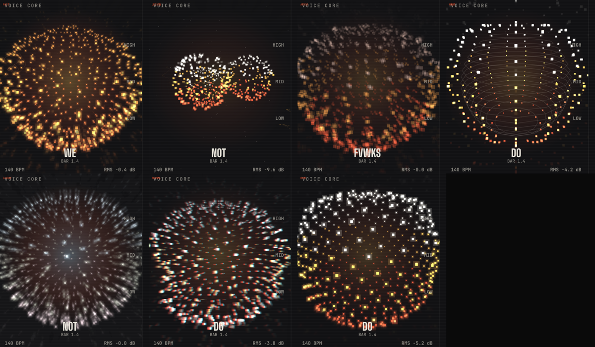

# S4 APP + RELEASE — status (FoxBox)

Branch `session/s4-app` · owns `app/` · last update 2026-09-29 (1.5.0 = SMART VISUALS + fixes + REMIX, in progress; 1.4.0 is live)

## 1.5.1 in progress (test build from 5e453c7)

- **Merged:**
  - main (contracts v0.12 / v0.12.1 / v0.13);
  - help/s3-151 up to c780942: Rekordbox server, mask recipes, the EDITED fix and export naming;
  - help/s1-popups e0b36c0;
  - help/s1-maskcreator 73f502e;
  - help/s1-camera-151 1e0d995: LS11, the one-face and fail-open fixes, the glasses rim.
  - Held: S2's help/s2-151-wip, until S2 says go (a harmony layer first). TOP layers and the macros stay behind ENGINE_V01112 until then.
- **Done:**
  - IMPORT FROM REKORDBOX: REMIX's picker, plus the Studio SONG strip and VISUALS TRACK;
  - REMIX ALL on;
  - export names by S3's rule (exportName.ts);
  - LS8 and LS10;
  - S5's pass-3 P2s;
  - the FIRST HIT lane.
- **REMIX design fidelity** (S5's list against the handoff; re-check: no P0s left):
  - before BUILD, the ORIGINAL timeline with the PRESS BUILD card;
  - all 7 lanes with merged strips and RMS bars;
  - the EXPORT drawer's done state;
  - BASS DNA's head;
  - caps sound names;
  - the dashed drop page;
  - the whole idle transport.
  - DOUBLE THE LAST DROP is off (the PM: the design rules).
- **Test build:** 5e453c7 is running as the user's test copy (smoke 12/12). Page work waits for the user's feedback.
- **Open, P2:**
  - the FIRST HIT lane's 2-beat clips barely show at FIT;
  - check REVEAL in the packaged copy.
  - Waveform energy is checked on real audio, and it's fine.
- **On the next merge of main or S2's branch:** re-export the REMIX openapi (contracts v0.14, `Chord` and `SongStructure.chords` / `RemixSection.chords`, main af33bdd) so the drift test stays green. No CHORDS row yet (no design).

## 1.5.3 is live (hotfix, published 2026-10-02)

- **Shas:** int/153 7ccb6e0, off the published 1.5.2 e0b72e9, merged to main as 9baa4c1c; snapshot f82230e0; v1.5.3 is Latest. session/s4-app is merged up to main (04a9709).
- **What it fixes:** TouchDesigner binds FoxBox's camera again.
  - In 1.5.2, camera_finder stopped on an unconnected Syphon In's default size, so the looks had no camera.
  - Also S1's in_text clamp (TD keeps at most ~20 rows of FoxBox's text OSC), `camera` in status.json once bound, and /foxbox/td_camera [bound, w, h].
  - It's S1's 7c3a9797 on b8ae89e1, taken whole for foxbox_setup.py. The presets are unchanged.
- **Update:** about 30 MB (app 22.2 + engine-code 7.8). engine-code's hash moves every release even when the engine is unchanged. electron is reused from v1.5.2 and engine-runtime from v1.2.1.
- **Checks:**
  - rc-smoke PASS 11/11 on its second run: PROD live in 21 s, OUTPUT 257/257.
  - Its first run caught one TD window on screen at one poll.
  - S3's fake-camera check PASS: camera bound, in_text_rows 21, camera at 20 fps, TD quits cleanly. S3 reproduced the window: the editor window shows for ~0.1 s as the project opens, before keepHidden's 250 ms re-hide.
- **For 1.5.4:**
  - S3 fixes that editor-window flash: help/s3-hide-guard 1de1c348 changes syphon_host.mm (a new `guardHidden` export), so **rebuild the addon** for the RC. build.sh now prints the bundled addon's exports by name, and `guardHidden yes` must show: tdSession only uses it if present, so an old addon degrades silently to 16 ms polling;
  - S4 reads /foxbox/td_camera into the `[TD]` line (gate on bound, since an unbound Syphon In has a default size);
  - once the all-v3 set lands: PROD's v2 knob bridge goes and tests/unit/main/tdPresetsSet.test.ts moves to the new counts.
- **rc-smoke** (`.claude/s4-keep`) reads the version from the app, logs any TD window's bounds, and checks WHAT'S NEW as if updated from 1.5.1.

## 1.5.2 is live (published 2026-10-02)

- **Shas:** built from int/rc 12400df, merged to main as 6b26681e. main is 1c239945 (plus the 1.5.2 README and a dev-tool path fix); GitHub snapshot 538c5a73; v1.5.2 is marked Latest. session/s4-app is merged up to main (e0b72e9).
- **What shipped:**
  - PROD · TOUCHDESIGNER with 12 looks: BODY 8 / HANDS 4, of which v3 networks are PLEXUS, WINDOW MOSAIC, GLOW TRAILS and SLIT SCAN, and the rest v2 shaders through PROD's knob bridge;
  - the new VISUALS (S5);
  - FACE CHECK, MASK FIRST and CAMERA BLOCKED with OPEN CAMERA SETTINGS;
  - TouchDesigner hidden (0 windows on screen);
  - REMIX WIP.
  - FINGER WINDOWS, LINE SCAN and DOT SCREEN: 1.5.3.
- **Update size:** about 158 MB for 1.5.x users (app 22.2 + electron 127.6, new for 44.5.1, + engine-code 7.8). engine-runtime is reused from v1.2.1's asset. DMG 420.5 MB, full zip 453.1 MB.
- **RC smoke:**
  - PROD setup → live in 24 s with 0 TouchDesigner windows on screen;
  - OUTPUT 96/96 frames per 5 s;
  - no page errors.
  - A first install shows no WHAT'S NEW, by design; rc-smoke checks it as if updated from 1.5.1. Quit takes ~10 s with TD live.
- **For 1.5.3:**
  - the remaining v3 looks; then PROD's v2 knob bridge goes (prodFeed, marked `ponytail:`) and the set test (tests/unit/main/tdPresetsSet.test.ts) moves to the new counts;
  - the authors fill each look's `gestures` / `new` in preset.json.

## 1.5.2 now: PROD + VISUALS refresh, td5, then the RC

- **PROD · TOUCHDESIGNER** is on help/s4-prod (74d5d27; S5's review passed). Its checkout is `.claude/s4-prod` inside the S4 worktree, and the release kit (build.sh, boot-check.mjs, surgepy's .so) is in `.claude/s4-keep`. Nothing lives in /tmp any more: a reboot wiped it once, and PROD was rebuilt from the session transcripts.
- **Shared on session/s4-app** (S5 builds the VISUALS refresh on it): tokens (+ --vb-hands, --vb-knob-size), stageSource / feedStageFrames, useLiveDeck (deck, startTrack), useOutputOwner, the TD layer (TD_STYLE, sceneHasTd, addTdLayer), the face selectors (tdFaceVisible; MASK FIRST is useTdCamera.maskFirst), the six knobs (tdKnobs for S2).
- **td5 / RC merge order (the PM's checklist):** S3's tip (flicker fix, OUTPUT-black fix if on S3's side, PLEXUS/MOSAIC v3, FINGER WINDOWS + gesture commands) → S1's help/s1-td-presets (7f339b1+) → S2's help/s2-td-sound (the 4 hand presets with mode "hands") → help/s4-prod → help/s5-visuals (RC only). Then typecheck, vitest --maxWorkers=4, and PROD shows BODY 10 / HANDS 4+.
- **Closed:** the "black perform pop-out" was TouchDesigner's own Perform window (S3's e721b3f hides TD entirely); FoxBox's OUTPUT measured fine in every arrangement. Kept as insurance: the occluded-window switches, OUTPUT's 50 ms show timer, and main.log's `[OUTPUT] N frames received, M shown` line.
- **Heavy work** (builds, packaged runs) only in the slot the PM assigns; vitest at --maxWorkers=4.
- **td5** (int/td5 e141760) was tested by the user. OUTPUT logged 234/234 frames. The camera prompt needed a LaunchServices re-register (`lsregister -f`) of the staged copy before tccutil knew its .test id. The lag was mostly an unrelated Blender render.
- **RC kit, in `.claude/s4-keep`:** build.sh (`build.sh <sha> --release`), rc-smoke.mjs (boot, 1.5.2 WHAT'S NEW, rail, PROD setup, the new VISUALS, OUTPUT frames in main.log), and release-notes-1.5.2.md (the GitHub body, with the tccutil line; the update size gets filled from the RC's components).
- **1.5.2 is held (the user's call) until all 15 effects are v3 TouchDesigner networks within budget.** int/rc (in the `.claude/int-td5` checkout) already has S5 c71cc8d and S3 5953f4a. S1's and S2's preset branches merge as they land, then the presets folder is pinned to the final set (presets only, never foxbox_setup.py), the v2 knob bridge goes, and the addon is rebuilt from int/rc's syphon_host.mm. Nothing gets published until the PM asks the user.
- **Into the RC on top of int/td5:** S5's camera-blocked fix (help/s5-visuals c71cc8d+), the full v3 preset set when S1/S2 have optimised it (then remove PROD's v2 knob bridge, marked `ponytail:`), and S3's App Nap finding.

## 1.5.2 plan: TouchDesigner (S3's free TD + OSC + Syphon route)

- **Electron 44.4.5 → 44.5.1:** needed for IOSurface → `sharedTexture` → VideoFrame, and it's on npm. The `^44.4.5` range already allows it, so `npm i electron@44.5.1` only moves the lockfile.
  - The electron component (~128 MB) changes, so the 1.5.2 update is ~160 MB, not ~30. Say so in its notes.
- **Syphon.framework (BSD):** at packaging it must be signed with the app's identity. electron-builder signs Contents/Frameworks with the app (ad-hoc `-`), and the release recipe's `codesign --verify --deep` checks it.
  - **Placement:** components.ts puts every `Contents/Frameworks/*.framework` in the electron component, so a later Syphon change would re-download 128 MB. Decided (the PM, (a)): when S3's branch integrates, components.ts classifies Syphon.framework as `app` (one line; the afterPack hash follows), so a Syphon change never re-downloads Electron.
- **TouchEngine.framework:** parked (the paid-key path).
- **1.5.2 is held (the user's call) for more TD effects:** S1's camera presets, S2's live audio-FX chain on VISUALS' TRACK playback, and S3's camera into TD plus the preset contract. When they land, S4 merges them, adds a "CHANGES THE SOUND" chip on such presets and one AUDIO FX on/off in the TD panel, plus WHAT'S NEW lines, then the test copy and the RC.
  - Done in S4: the AUDIO FX switch, the CHANGES THE SOUND chip, each preset's `how` under its name, and WHAT'S NEW lines (to recheck). Merged up to d263b76: S3 a09127e, S1's 10 presets 543b67a via S2 7b1316f.
  - Next: td4 (the pipeline test) once S3's stuck-frame fix lands, then rerun the addon build. The RC waits for the v3 presets (real TD networks, build.py per preset; Resources/touchdesigner/presets already ships the whole folder).
- **REMIX is WIP in 1.5.2 (the user's call):** greyed in the rail like PROD, with the WIP badge, and not reachable; it replaces the BETA badge, and the REMIX code stays. TD stays a VISUALS base; the TD page becomes PROD once its Claude Design lands.
- **From S3 later:** the VISUALS pieces (the TD source row, the DEMO · NON-COMMERCIAL label, the inline "Get TouchDesigner" panel).

## 1.5.1 is live (73eb4a0; v1.5.1 on GitHub, snapshot b83b035)

- **Scope:**
  - the new REMIX engine (S2's help/s2-151-wip e60ffec, with S3's M2.5, v0.15.2/.3, sample packs and notices);
  - S5's REMIX rebuild, with a BETA badge in the rail;
  - MASKS Phase 2, on for everyone;
  - S1's tracking (8b09871: one mask per head, head-first);
  - SAMPLE LAYERS; TOP and the macros on (ENGINE_V01112); the client at v0.15.3.
- **Build:** app part 22.0 MB and engine-code 7.8 MB are new (~30 MB update). Electron and engine-runtime are reused from v1.2.1. DMG 420.5 MB, zip 453.1 MB.
- **Checked:** 597 unit tests; contract tests; a boot check on a .test clone (3/3). The earlier RC smoke passed boot, rail, STUDIO, VISUALS output and REMIX's ALL TRACKS ▾. The user asked to ship sooner, so the rest (BUILD, export/REVEAL, SAMPLE LAYERS on the real routes, MASKS) wasn't finished.
- **For 1.5.2:** finish the rest of the RC smoke (scratchpad rc-smoke.mjs; scope its BPM wait to REMIX's deck). The first-run deck question was a smoke artefact (S5 checked all three load paths on a fresh install).

## MASKS page, Phase 2 (the user's Claude Design, app/design/masks)

- **What's in:** the page is rebuilt to the design's README and prototype on session/s4-app (dfd933c → c72e43d):
  - LINEUP (8 presets, one live stage, the acts);
  - CategoryTabs (9 slots; HEADS is LATER);
  - MaskPreview (status display, MODEL / LIVE / DJ CLIP, the viewport chrome, BEAT with the demo-drop waveform, A/B, FX FULL | REDUCED, the perf strip, the LIVE states);
  - the options panel (POSTER tiles with hover preview, ParamSlider, palettes and + CUSTOM, PATTERN / DECAL / TAG);
  - GlowPanel (FX PRESETS, REACTS TO, FLASH RATE, 7 FxModules with SOLO);
  - the SaveBar (RANDOMIZE choreography, NAME hints with REPLACE / SAVE AS n, WEAR);
  - MY MASKS (IMPORT drawer, inline delete, BUILT-IN).
- **Model:** the store keeps 80 undo steps with one per drag. MaskConfig v4 lives in camera/maskConfig.ts: S4 owns the tables, S1 owns normalize. The 3D, thumbnails and the face registry are S1's (maskStage, maskThumbs, maskFace).
- **Checked:**
  - 3 store tests: randomize with locks, undo, save hints;
  - the web mock at 1512×982 and 1280×800;
  - a .test smoke of 9/9: LINEUP → START WITH → flip → lock + R → ⌘Z → ⌘S → MY MASKS, with no page errors.
- **Open:**
  - Image masks can't be renamed: the engine has no endpoint for it, so RENAME is hidden on them. This is a contract gap.
  - The DJ CLIP chip reads "AT THE DECKS · NODS ON THE DEMO BEAT" (the PM's call).
  - The flag stays until the user signs off.

## MASKS page, Phase 1 (1.5.1 flagship, 4a3fd3e)

- **Where it is:** `app/src/renderer/src/components/masks/`, built on S1's `maskRecipe.ts`, `recipeMask.ts` and `maskTurntable.ts` (a2da131 merged). It uses the component names from `docs/MASKS_DESIGN_PROMPT.md`.
- **Flag:** the rail shows 03 MASKS only in dev or with `localStorage foxbox-masks = 1`. Packaged builds keep 01–07 until it ships (`state/ui.ts`).
- **Options:** read off the recipe (choices, numbers, colours, switches), so S1's recipe changes show up on their own. S1 is asked to export `CHOICES`.
- **Checked:** web mock at 1280×800 and 1512×982 (the core loop, taken-name hint, WEAR sets `recipe:<id>`), 2 unit tests, and a .test smoke with a cloned 1.5.1 app plus the new renderer: PASS 10/10 in 41 s.
- **Not checked:** LIVE try-on (no camera in the tests, by the TCC rule).
- **Waiting on:** the user's Claude Design for MASKS, which restyles it.
- **Kept test app (b31deab):** 5e453c7's package (same engine) with this branch's main, preload and renderer swapped in, the asar hash fixed, ad-hoc signed, stock bundle id. It's in S4's scratchpad (`testapp-151-masks/`); the PM sets its .test id and home. Made with `swap-app.sh`. The full build waits for S2's integration (then the SAMPLE LAYERS smoke, and REVEAL in the export smoke).
- **Also in:** SAMPLE LAYERS (M3.9) under GENRE FLIP's KIT; the FOXBOX_MASKS=1 flag; recipe v3 (glow.mode, accent, and the rest).

## 1.5.0 is published (2026-09-29)

- **Release:** v1.5.0 on GitHub, marked Latest. The snapshot is c4f3c49, history-free, made from ff85c53, whose app matches the RC built at 4c395b0. The feed (releases/latest/download/latest-mac.json) resolves to 1.5.0. Electron and engine-runtime are reused from v1.2.1, so the update is about 23 MB.
- **Checks:** unit 560 pass; e2e 6 pass, with the stale Studio RECORD test skipped. The isolated RC smoke passed all 12 checks: boot, STUDIO render, VISUALS output (display kept awake, live strip), and REMIX BUILD/ROLL/rate/play/MP3. LOW-POLY and DEPTH GLITCH were checked on the dev build's fake camera.
- **Found by the smoke and fixed (4c395b0):** REMIX BUILD never split a new track's stems.
- **1.5.1 queue:**
  - REMIX ALL; the TEAROUT card; TOP layers and bass macros (S2's M1.14);
  - LS8 and LS10; LS11 (the VISUALS camera base needs PrivacyHelp when access is denied, with S1);
  - the RECORD e2e rewrite on VISUALS;
  - S5's pass-3 P2s (R16–R21);
  - from the smoke: take 1 reads EDITED after a ROLL, an empty second SYNTH BASS lane, the export named "<track> VIP VIP";
  - the MASKS rail item (renumbering the rail, with S1's page);
  - Developer ID signing (the PM's option; ad-hoc cdhash changes drop camera grants).

## 1.5 handoff (read first)

**Scope (from the PM)**
- (a) VISUALS layout: the preview IS the output. ASPECT (9:16 default | 16:9 | 1:1) drives the stage, the output window, SAVE CLIP and REC LIVE. The stage is as large as possible. It renders once at output resolution and feeds the output window those frames (ImageBitmaps over the MessagePort), not a second compositor.
- (b) Compositor: the near-mask pass-through, TEXT plumbing, the AUTO-VJ director hook, and a flash limiter (WCAG 2.3.1).
- (c) A mandatory update at boot: ≤4 s check; UPDATE REQUIRED with progress; never brick (offline, feed error, or 2 failed downloads → error + CONTINUE); Setup unaffected.
- (d) Remove every `.FoxBox.app.previous-*` after a confirmed start.
- (e) WHAT'S NEW: full-window, on-brand, **no mascot**. The animated mark, the lattice bg, glass cards with 01/02 kickers and facet glyphs, LET'S GO, "Stay stealthy.". It merges the notes of skipped versions and works offline.
- (f) SETLIST → PROD: greyed out with a WIP badge, not clickable. Don't build PROD.
- (g) Merges plus the 1.5.0 build; engine-runtime must reuse v1.2.1.

**Done on session/s4-app**
- 271f292 (d): sweep backups.
- a15c9e6 (f): PROD WIP.
- 53c2e76: v0.10 API types; Song.builds typed number[][] because openapi-fetch maps the tuples.
- 68c951c (b): shapes, AudioFrame structure/bass fields (S2's names), TextTrack/setText, setParams, FrameExtras, setDirector/ScenePatch.
- e091fbb: layers get `extras`.
- 8d6ac29: FlashGuard (WCAG 2.3.1, a 16×16 GPU probe, damping mixes toward the last frame).
- 94756dd (e): WHAT'S NEW.
- ac88c93: S2's asks, EffectLayer.locked and ScenePatch.saturation.
- Merged: S2 help/s2-smart (ebb57f7) and S1 help/s1-smartcam (f61c803, 5040390).
- d30ab50: the CAMERA base is S1's smartCameraBase.

**Merged since** (all helpers are done):
- (a) `s4-visuals-aspect`, merged at 7490170:
  - `aspect` lives in the visuals store (9:16 default), with its control on the stage bar. SAVE CLIP and REC LIVE follow it.
  - The stage renders at CLIP_SIZE. The output window just shows the stage's ImageBitmaps over the MessagePort, one in flight, acked by `shown`.
  - Leaving VISUALS freezes the output on its last frame.
  - Not tried in Electron yet; the bar-wrap stage-height formula needs checking there.
- Styles `s4-visuals-structure`: the shared `styles/structure.ts` plus all 7 FOXBOX styles, with setParams.
- (c) `s4-boot-update`, merged at 964c2c7. `FVWKS_SKIP_BOOT_UPDATE=1` skips it; the quick-launch harness sets it.
- 99c3db8: the "check automatically" toggle is gone (the user's call). The background check always runs; old updates.json files still load.
- 8a6cd04: CSP `connect-src` gains `blob:` for S3's TEXT fonts.

**Also done since**
- ea4dc48: S1's near mask goes to the stage's frame extras (CAMERA base), and CameraControls sit in BASE.
- 134284f: the AUTO toggle (EFFECTS header) drives `autoDirector`, with a per-layer LOCK while it's on.
- 5b9f250: TRACK frames carry the song's structure.
- 0102bf2: Scene.text comes from lyrics or the drop script (visuals/live/sceneText.ts, not persisted). It POSTs /lyrics once stems are done.
- Merged S3 help/s3-smart 63a6400 (lyrics routes, smart ISF, imagePalette; deps troika-three-text and colorthief).
- Walked in Electron (built app, isolated): the stage is 1080×1920 at 9:16, and the output window mirrors the stage's frames at 16:9.

**1.5.0 state (2026-09-29, latest)**
- session/s4-app 32ff3ec plus the ghosting fix 02a7371: vitest 527, engine suite green (~620).
- Merged: REMIX (page on S3's generated routes, v0.11.5), S1 synth (CC0) and .als, S2 bassdna/lock, S3 remix server and 15fix, S5 UX (type floor, #13/#1/#18, #6/#14/#16), and main up to v0.11.5.
- Candidate e072e5f in scratch rc2/ (one tree only; the test HOME is removed after each launch). S3's step-3 OUTPUT re-check PASSED, and my isolated launch passed.
  - Feed reuses electron and runtime from v1.2.1; app 16.1 MB + engine-code 5.8 MB, about 22 MB to update.
  - Release fixes from this round (all committed): bundle_engine ships fvwks_synth; surgepy builds with -ffile-prefix-map (no home path); app.asar excludes node_modules (113 → 33 MB).
- Still to come: S1 help/s1-faces, S3 /api/masks, S5 P1/P2 batches, the Claude Design package for REMIX (the user runs it), then release notes for REMIX and the final candidate.
- The rc/ checkpoint (4a73d0b) is still in scratch; drop it once the final candidate exists.

**Plan change (user, 2026-09-29): one big 1.5.0 = SMART VISUALS + the fixes + REMIX.** The 4a73d0b candidate is a checkpoint only; never move it to app/release.
- Merged: S2 keyfix (b3b4c9b, facbf77), S1 calibration 80ff949, main (contracts v0.11.2). API types in fd1ecd2.
- REMIX deps in 9e52887: tone, @waveform-playlist/browser + playout, styled-components, @dnd-kit/{react,dom,abstract}. All reported to the PM. Signal's piano roll and react-timeline-editor are deferred.
- In flight: a helper is building the REMIX page Phase 1 (unstyled, functional, MSW mocks, TS types mirroring contracts v0.11.2 until the OpenAPI has the routes) in its own worktree. Merge it when it reports. The styling comes from the user's Claude Design bundle.

**1.5.0 candidate (built, not published, 2026-09-29)**
- Sha `4a73d0b`. Built into the scratchpad's `rc/app/release/1.5.0/`, deliberately NOT app/release, because the PM's watcher publishes that folder.
- Feed: electron and engine-runtime are reused from v1.2.1. New: app 24.4 MB (the MediaPipe models and vision worker) and engine-code 1.5 MB, so the update is about 26 MB.
- Checked: vitest 513; isolated quick launch passed (engine ready at 11.5 s); in Electron, the 9:16 stage, the output mirror, and TEXT with no CSP errors.
- S1's QA passed with no blockers: the packaged vision worker loads all models; SAVE CLIP at 9:16 with TEXT runs at 3.6× realtime and matches the stage; the camera styles, AUTO-FRAME and pass-through were checked on a dev build with the fake camera. For 1.5.1, S1 is fixing calibration taking a leaned-in baseline.
- Waiting on the QA walk (asked): S3 for pre-drop TEXT, MILKDROP cuts, AUTO-VJ and LOCK, output equal to the preview, the boot update, WHAT'S NEW.
- The 1.5.1 queue, to merge only after 1.5.0 is published: S2 help/s2-keyfix (b3b4c9b, facbf77: key detection) and S1 help/s1-smartcam 80ff949 (calibration from resting frames).
- When the PM says go: `mv` the folder atomically into app/release/1.5.0 (copy to `.tmp`, then mv), then send `S4 RELEASE 1.5.0 4a73d0b`.

**Rules (standing)**
- ponytail (full): shortest correct diff; no new deps or abstractions; one runnable check; `ponytail:` marks.
- Downloads under 1 GB need no approval; over 1 GB needs the user's OK. Report every new package or model to the PM (why, what, how popular).
- Lean QA, but walk the headline flows.
- Isolated test launches only: S4's bundle id is `com.smittytech.foxbox.test.s4`, with its own temp HOME and CDP port 9314 (`S4_CDP_PORT`). Quit only by the PID you launched; never killall/pkill FoxBox or quit by name or id (rule of 2026-09-29).
- Release: build from `git archive` of a sha. engine/uv.lock (gitignored, never committed) must match the v1.2.1 runtime (wrapt pinned to 2.5.0, no new Python deps; vendor into engine-code instead). Check latest-mac.json's engine-runtime URL before writing the release dir. Write the release dir atomically (`.tmp` + mv), because the PM's watcher publishes it.
- Prettier: `--no-semi --single-quote --print-width 140 --trailing-comma all` on touched files only.
- No credit email in git. No old act name. No absolute home paths in this file.


## Handover: cutting a release (1.2.1)

**Steps**
1. Bump and write the notes, then commit: `npm version <x.y.z> --no-git-tag-version` in `app/`, and write `app/release-notes/<x.y.z>.md` (one `-` line per note).
2. **REMIX, from 1.5.0: surgepy (Surge XT's Python module, GPL-3.0, 8 MB) is git-ignored.** In step 3, after the `git archive` and before `release.mjs`, build it into the export:
   `sh <tmp>/engine/synth/native/build_surgepy.sh <scratch>/surge-work`. It uses the pinned Surge commit plus our setTempo patch, needs a ~420 MiB download the first time (keep the work dir for reuse), and builds in ~1.5 min. It lands in `<tmp>/engine/synth/src/fvwks_synth/_native/`.
   After the build, check that the app has it and that it's signed: `find <app> -name 'surgepy*.so' -exec codesign -v --strict {} \;` (it should be under Resources/engine/code/fvwks_synth/_native/). Without it, the FoxBox patches still work, but the Surge ones grey out.
3. Build from a clean export, so nothing uncommitted ships (run step 2's surgepy build inside it, before release.mjs):
   ```
   git archive <sha> | tar -x -C <tmp>
   ln -s <worktree>/app/node_modules <tmp>/app/node_modules
   cp engine/uv.lock <tmp>/engine/
   cp app/credit.local.json <tmp>/app/        # gitignored; injects the credit email
   cd <tmp>/app && node scripts/release.mjs --no-bump
   ```
   - This takes about 10 min: electron-vite, S3's `bundle_engine.sh`, electron-builder, the DMG and zips.
   - `--prev-feed <url|file>` is the feed to reuse parts from. The default is the latest GitHub release's `latest-mac.json`.
   - `--asset-base <url>` sets where the new parts will be downloaded from. The default is `https://github.com/als7294/FoxBox/releases/download/v<version>/`.
4. The output goes to `app/release/<version>/`:
   - `FoxBox-<v>-arm64.dmg`, for first installs;
   - `FoxBox-<v>-arm64.zip`, the full app, which clients before 1.2 use;
   - `FoxBox-<part>-<hash16>.zip` for each new part;
   - `latest-mac.json`.
5. Publish (the coordinator does this): `gh release create v<version> --repo als7294/FoxBox` with every file release.mjs lists. The tag name must match the part URLs in the feed.

**Parts** (`app/src/main/components.ts`)
| Part | What's in it | Size |
|---|---|---|
| `app` | app.asar, Info.plist, the executable and helpers | ~5 MB, every release |
| `electron` | `Contents/Frameworks/*.framework` | 128 MB zipped, changes only with Electron or its fuses |
| `engine-runtime` | `engine/runtime/` | 293 MB zipped, changes only with uv.lock |
| `engine-code` | `engine/code/`, bin/, MANIFEST.txt | ~1 MB |

- An electron-builder `afterPack` hook hashes each part (paths, exec bits and contents; `.pyc` and `__pycache__` left out) into `Contents/Resources/components.json` before signing.
- release.mjs reuses the previous feed's entry, including its URL, for any part with an unchanged hash, so a part is never uploaded twice.
- Two clean builds gave identical electron and engine-runtime hashes.

**Feed v2** (`latest-mac.json`)
```
{ "version": "1.2.1", "released": "YYYY-MM-DD", "notes": ["…"],
  "files": [{ "name": "FoxBox-1.2.1-arm64.zip", "kind": "zip", "size": n, "sha256": "…" },
            { "name": "FoxBox-1.2.1-arm64.dmg", "kind": "dmg", "size": n, "sha256": "…" }],
  "components": [{ "name": "app" | "electron" | "engine-runtime" | "engine-code", "hash": "<64 hex>",
                   "url": "https://…/FoxBox-<part>-<hash16>.zip", "size": n, "sha256": "…" } ×4] }
```
- Clients before 1.2 read only `files`, which is the full zip.

**How a 1.2+ updater uses it** (`app/src/main/updater.ts`)
1. It downloads only the parts whose hash differs from its own `components.json`, checking size and sha256.
2. It clones the running app (`cp -c`) into `userData/updates`, removes the changed parts' files, and unpacks the new zips with ditto (which keeps the per-file xattr signatures).
3. It strips quarantine, re-signs ad hoc with `--preserve-metadata=entitlements`, and verifies with `codesign --verify --deep --strict`, the bundle id and the version.
4. It swaps the new app in and relaunches, with the same backup and rollback as before.
5. On any failure short of a cancel, it falls back to the full zip.
- The update bar shows the real download size.
- A private-repo (token) feed always uses the full zip.

**Not yet proven end to end:** a real small update from one published 1.2.x to the next hasn't been run.
- Unit tests cover the parsing, planning, hashing and pruning.
- `scratchpad/small-update/harness.ts` (outside the repo) drives the real Updater against local release folders, if someone wants to run it.
- The first small update to go live, 1.2.1 → 1.2.2, is the real test. If it fails, the fallback is the full zip.

**Test launches:** use a copy with bundle id `com.smittytech.foxbox.test` and a temp `HOME`/`CFFIXED_USER_HOME`, and never touch the user's data folder.

## Where things stand
| Area | State |
|---|---|
| Scaffold (electron-vite 5, Vite 7, React 19, TS 5.9 strict) | done |
| Engine supervisor (spawn, READY-line port, health wait, restart w/ backoff, process-group kill, stale-pid cleanup, logs) | done, 11 unit tests against a fake engine |
| Preload bridge (contextIsolation + sandbox, no nodeIntegration, CSP meta) | done |
| Engine access: IPC proxy + `vbx://audio/<id>` | done (see "Deviations") |
| Typed client (openapi-typescript + openapi-fetch) from `contracts/openapi.yaml` | done: `npm run gen:api` |
| TanStack Query + Zustand stores | done |
| MSW mocks (contracts/examples + fixture WAVs + crude pitch/drive/bar-fit render) | done: `npm run web` / `npm run dev:mock` |
| Waveform + BarGrid + words + playhead + A/B + gapless loop (Web Audio) | done; Phase 2 replaced wavesurfer with the design's canvases: band-coloured waveform from the decoded render, reveal and morph sweeps, bar grid with lit beats |
| Recorder (askForMediaAccess → getUserMedia → AudioWorklet → 24-bit WAV, meter, 3-2-1 count-in, takes) | done; e2e records a synthetic tone through the real pipeline (worklet → WAV → multipart over IPC → engine ingest → render). A real mic is untested. |
| Import (engine formats as-is; others via decodeAudioData → WAV) | done; e2e covers both paths against the real engine |
| Re-render on release (150 ms debounce), stale dimming | done |
| Shortcuts (Space, ⌘↩, ⌘⇧E, `\`, L, M, 1–7, ⌘S, R, ?, Esc) paused while typing | done. EXPORT moved to ⌘⇧E in 2.1 because ⌘E is ECHO inside the script editor; M toggles the metronome (2.3) |
| Screens STUDIO / VAULT / SETLIST / VOICES / SETTINGS with the handoff component names | done; styled to the TRANSMISSION design (Phase 2). DOSSIER was dropped in 2.1 (user decision) |
| Drag-out (`startDrag`) from cartridge, export rows, Vault rows (multi) | done; e2e verifies dragstart → startDrag({file, icon}) with a real PNG icon and refuses unreturned paths. **The drop into Finder/GarageBand needs a manual check (computer-use access was declined).** |
| Contracts | on **v0.1** (merged `main` incl. S3's integrated server): partial arrange/master (hint rule), word ticks + now-speaking, script preview (SAYS line + warnings), analysis_state chip, persona candidates, `Take.source_id`, export warnings |
| Playwright Electron e2e (7 tests) | **7/7 passing against the real engine** (Kokoro-MLX voice + the FVWKS rack, v0.3; last run 2026-09-27, Phase 2.2). They cover the core loop (typing → auto-preview → ⌘↩ final → export sheet → WAV on disk with fmt tag 1), the drag chain, engine SIGKILL → restart → render again, record, import (+ conversion), a 5-line setlist → 5 files + playlist XML → Vault play + Rekordbox export, and every screen. Plus an opt-in `shots` spec for the design screenshots |
| Vitest | **123 tests in 20 files passing** (Phase 2.2), including: a whole-app jsdom smoke test; the model-install flow; macro→param values checked against the engine (S2's table); the export guard's S3 repro; the engine-epoch rule; Vault and Setlist against the mock engine; v0.3 (AUTO bars + the capability probe and fallback, clean-up, transcripts) |
| VOICES: model installs + persona designer | VOICES → MODELS lists every model the engine offers (Phase 2.2); install is a background job: size, free disk before/after (5 GB reserve), progress, cancel, `disk_full` with S3's hint, models/voices refresh on completion; persona designer uses `GET /api/personas/candidates/{id}` |
| Engine venv upkeep | the pill says INSTALLING ENGINE / UPDATING ENGINE while it runs (Phase 2.2); `uv sync --all-packages` runs automatically when `.venv` is missing, when any engine `pyproject.toml`/`uv.lock` is newer than the last sync (e.g. S3 added `mutagen`), and once more if a launch dies during startup |
| Packaging (electron-builder --mac dir, ad-hoc, fuses, mic usage string) | done; installed at `~/Applications/FoxBox.app` (v0.1 build), linked to `~/VoiceBox/engine` |
| Phase 2 (Claude Design bundle in `app/design/`) | see "Phase 2" below |

## Phase 2: the TRANSMISSION design (Claude Design handoff in `app/design/`)
Status: implemented across STUDIO, VAULT, SETLIST, VOICES and SETTINGS, plus the states from the brief and the addendum.
Screenshots live in `app/docs/screens/after/1512x982` and `after/1280x800`, captured against the real engine with
`FVWKS_SHOTS=docs/screens/after npx playwright test shots`. The pre-FoxBox sets (Phase 1, the prototype, and the
old-brand after/ set) were removed with the rename; the after/ set is retaken with the FoxBox brand.

### What was ported
- **Tokens and themes.** Every value lives in `styles/tokens.css` (`--vb-bg`, `--vb-panel`, `--vb-ink`, `--vb-dim`, `--vb-accent`, `--vb-amber`, `--vb-font-mono`, `--vb-font-display` and the rest).
  - One theme, TRANSMISSION. The DOSSIER alternative was dropped in 2.1 (user decision): no switch, no stencil/Courier fonts.
  - Canvases read the same palette from `visuals/theme.ts`.
- **Fonts.** Big Shoulders Display, JetBrains Mono, Courier Prime and Saira Stencil One, bundled as woff2 from `@fontsource` (OFL texts alongside). No CDN.
- **Visuals and motion.** Ported from `voicebox-engine.js` into `src/renderer/src/visuals/`, fed by real data instead of the prototype's synthetic voice. `support.js` and the mock logic are not shipped.
  - **Waveform:** band-coloured (low/mid/high one-pole splits of the decoded render), with reveal and morph sweeps, stale greying, played-part dimming and word labels from `Segment.words`.
  - **Bar grid:** beats light up during playback; loop shading; overflow hatching.
  - **Voice core:** a particle sphere driven by the output analyser and the four macros. Its labels show the resolved pitch and ring.
  - **LED loudness meter:** anchored to the render's measured short-term LUFS and true peak, and live while playing.
  - **Also ported:** the cartridge mini-waveform, the record orb/strip/level, the boot sequence and the screen wipe.
  - **Performance:** one shared RAF loop that pauses while the window is hidden. Nothing animates on the input path; knob drags, typing and renders never wait on a frame.
- **Reduced motion.** `prefers-reduced-motion` turns off:
  - the boot, panel reveals, screen wipes, knob tweens, drawer, toast and banner entrances, and sweeps (renders swap instantly);
  - the idle voice-core spin, the synthesis shimmer and the orb's idle arcs;
  - all CSS transitions.
- **Boot.** The boot screen is driven by the real start-up: engine pid, model-load progress from `/api/health`, lexicon, rack, BPM. Any key or click skips it, and it never waits more than 6.5 s. With `health.state = error` or an offline engine it prints `[ FAIL ]` and hands over to the banner.
- **Studio.**
  - **Auto-preview:** typing pauses → preview (the design's 1.3 s). RENDER (⌘↩) is the final render and auto-exports. EXPORT (⌘⇧E) hands over the final file; ▾ opens the full export sheet.
  - **Macro knobs:** tweened preset changes and double-click reset. Map rings come from the preset's `macro_map`, using S2's resolve formula (verified against engine values in `macros.test.ts`).
  - **Rack drawer:** the generic ModuleCard for every ParamSpec kind (knob, fader, switch, select, segmented, number stepper), closed-summary and advanced states, live values for macro-driven params, and the STACK voices.
  - **FIT:** FIX chips from `FitReport.suggested_bars`. **MASK STRENGTH:** reasons on hover or focus. **Banner:** the full state list.
- **Other screens.** VAULT (declassify-on-hover redaction, filters, selection bar → Rekordbox playlist with the "✓ WRITTEN" steps modal), SETLIST, VOICES (recommended voices, persona designer states, lexicon) and SETTINGS (auto-save, ENGINE card).
- **Kept from Phase 1:**
  - the component names from the brief, including EmptyState, ErrorState, ProgressOverlay, Tooltip and Modal;
  - the IPC proxy, `vbx://`, drag-out, and all shortcuts (plus R to record and Esc to close).
  - All 7 e2e tests, with updated selectors, plus an opt-in `shots` spec.

### Security fixes from S3's review (main process)
- **Engine token:** passed to the engine in its environment (`FVWKS_TOKEN`), never in argv (argv is visible to every local user through `ps`).
- **Export guard:** learns paths only from engine-generated structures: ExportedFile, RekordboxResult, and a finished batch job's `.xml`. It learns roots only from GET `/api/health` and GET/PUT `/api/settings`. User-echoed strings no longer count; there's a unit test for S3's repro.
- **Drag icon:** always main's own PNG; images from the renderer are never decoded.
- **Trusted URLs:** checked by path containment, not by string prefix.
- **Packaged builds:** ignore `FVWKS_ENGINE_CMD`, `FVWKS_UV` and `FVWKS_ENGINE_DIR`, and DevTools is dev-only.
- **Deferred:** `uv sync --locked`, until `engine/uv.lock` is committed at integration (this worktree's lock is stale, so `--locked` would block the engine); and serving the renderer from `app://` (follow-up).

### Engine integration (S3's review)
- **Engine error:** `health.state = error` shows ENGINE ERROR (pill and banner, with the engine's message and RESTART).
- **Superseded previews:** 409 `superseded` is ignored.
- **Lost batch jobs:** a lost job (404) stops polling.
- **Lexicon:** edits re-synthesize the current line.
- **Vault OPEN:** loads the take's own preset, chain, macros and stack.
- **Vault export:** uses Settings format, bit depth and playlist.
- **Error banners:** titled by code (EXPORT FOLDER UNAVAILABLE / DISK FULL / EXPORT FAILED). "Not exported: …" final-render warnings raise a toast.

### Phase 2.1 (2026-09-27): coordinator and user follow-ups
- **v0.3 contracts in the app:** API types are generated from `contracts/openapi.yaml` at tag `v0.3-contracts` (db6ccc5). The engine code comes with the coordinator's v0.3 merge, not in this branch.
- **Capability probe:** each (re)started engine gets one bogus render request with `bars: "auto"`. A 422 means pre-v0.2; a 404 (the source lookup) means v0.2+. v0.3 UI shows only when it answers yes. As a safety net, a 422 on an AUTO render falls back to 4 bars once, with a toast.
- **AUTO bars (v0.2):** the default and first in BARS, showing "AUTO · N" after a render (N = `RenderInfo.bars`). It's also available in SETTINGS defaults and per setlist line, is sent as `bars: "auto"`, and hidden on older engines.
- **Clean-up (P5):** OFF / LIGHT / FULL on RECORD and IMPORT, sent as `denoise` 0 / 0.5 / 1. Changing it re-sends the active take or file. The applied strength (`SourceInfo.denoise`) is shown.
- **Transcripts (P6):** a TRANSCRIBING… chip while `transcript_state` runs. When it finishes, the source is taken into the Studio and re-rendered, so its words show.
- **Editable transcripts (P7) and the script editor:** the insert buttons (BEAT BREAK / PAUSE ▾ / ECHO), in-editor chips, ECHO wording and in-editor shortcuts are S1's package (`help/s1-script`), merged here when done.
- **Shortcut scheme:** ⌘↩ final render everywhere; in the script editor ⌥↩ beat break and ⌘E echo; ⌘⇧E export everywhere (the menu too).
- **DOSSIER dropped** (user decision).
- **MSW mock:** emulates v0.3; `mockEngine.autoBars = false` emulates an older engine.

### Phase 2.2 (2026-09-27): the QOL build
- **The voice core moves per preset** (user request). `visuals/motionProfile.ts` derives the motion from the four
  macros and the live chain, so USER presets and edited chains get their own feel:
  - DEPTH → mass, gravity and size (heavier is slower). `layers.sub_gain_db` adds weight and sub pulses.
  - GRIT → turbulence and crisp particles, with `drive.drive_db` and `crush.bits`.
  - MACHINE → a lattice with beat-stepped rotation, with `machine.vocoder_mix` / `ring_mix`.
  - SPACE → trails and spread, with `space.reverb_mix` / `reverb_decay_s`. `mask.growl` → tremor.
  - Factory signatures on top: PACT embers, sub pulses and a satellite per stack voice; LEGION orbiting clusters, scan-line jitter and speckle; ABYSS a slow sinking drift with dark ember particles and tremor; UNIT the lattice, stepped rotation and crisp rings; GHOST pale trails; SIGNAL glitch slices and an RGB split on transients; RAW breathing.
  - The A/B dry side drops the signature.
  - Preset changes crossfade in about 400 ms. Reduce Motion jumps and freezes the decorative motion, but the sphere still answers the audio.
  - Trails are frame-rate independent (ProMotion runs at 120 Hz) and brightness-bounded.
  - All the visuals together cost about 1.1–1.4 ms a frame at 120 fps (p95 under 2 ms), measured in mock mode while playing each preset.
  - 
- **VOICES → MODELS** (S1 [HIGH]):
  - A strip with every model the engine offers (kokoro, deepfilternet3, whisper-aligner and the persona model), required first.
  - Each is a compact ModelCard sharing the persona designer's install hook (5 GB guard, progress, cancel, `disk_full`, a lost job).
  - `openModelsFor(id)` jumps there with that tile lit and its Download focused.
- **Lexicon SPELL** (S1 [MED]): pressed only when the engine really spells the word (an acronym whose `say` is blank or the word itself, compared the way `_norm_key` does).
- **Small fixes:**
  - Persona kicker "persona · male" (S1 [LOW]).
  - Auditions play to the end of the line, capped at 4.5 s (S1 [LOW]).
- **UPDATING ENGINE** (S2): the first `uv sync` after the Airwindows native module lands compiles for about 7 s. `EngineStatus.setup` drives the pill: UPDATING ENGINE or INSTALLING ENGINE, with "Updating the engine (uv sync)…" in the tooltip and the boot lines.
  - Render warnings "Unavailable in this build" (a failed native compile) raise one toast per session.
- **Hardening** (S3's second review): packaged builds ignore these dev-only overrides:
  - `FVWKS_MOCK` and `ELECTRON_RENDERER_URL` (the latter could point the window and its preload bridge at any page);
  - `FVWKS_DATA_DIR`, `FVWKS_EXPORT_DIR` and `FVWKS_USER_DATA_DIR`.
  - Also: `window.open` reaches only an allow-list of hosts, and `vbx://` ids no longer admit `.` or `:`.
- **Mock engine:** a short transcript job could end in "running" (its timers raced). That was the flaky v0.3 unit test.

### Phase 2.3 (2026-09-27): FoxBox, endings, metronome, credit, installer
- **FoxBox identity** (user decision):
  - appId `com.smittytech.foxbox`, `FoxBox.app`; data in `~/Library/Application Support/FoxBox`, exports default to `~/Music/FoxBox`.
  - Brand text FOXBOX, and the fox mark (`components/common/FoxMark.tsx`, from `design/brand/foxbox-mark.svg`) in the TopBar and on the boot screen.
  - The app icon is `build-resources/icon.icns`, built with iconutil from `design/brand/foxbox-icon-1024.png`.
  - `LSMinimumSystemVersion` is 14.0, because the bundled engine's wheels are macOS 14 arm64.
- **Endings never cut** (v0.4, contracts v0.5 types):
  - FIT reads "EXTENDED 2 → 4 BARS" with the engine's message and a KEEP fix, and shows the reserved tail after the speech (`FitReport.reserved_tail_s`). 'overflow' remains only for older engines.
  - END (`Arrange.snap_end`, BEAT → BAR → OFF) is a chip in the FIT readout, because the top bar has no room at 1280 or 1512. It's sent only once chosen.
- **Metronome** (M, CLICK in the transport): synthesized clicks with an accented downbeat on a lookahead scheduler. They stay locked to the render's bar grid through play, pause, seek, the gapless loop, A/B and new renders.
  - The clicks go out on a monitor bus beside the master, never into a render, an export or the meters.
- **Credit:** "Designed by SmittyTech" appears in the About panel, on the boot screen, in the SETTINGS footer and in the ? overlay.
  - The contact address is injected at build time (`__CREDIT_EMAIL__`) from `FVWKS_CREDIT_EMAIL` or the gitignored `app/credit.local.json`, so it's never in git.
  - Without it, the credit is plain text. main opens only that mailto address.
- **Voice core:** follows `RenderInfo.motion` (v0.5) when a render carries it:
  - beat lock, stutter holds, tape-stop brake and sag, the swell halo, throw-echo rings, squelch;
  - returns-driven tails, and a pitch ring from f0.

  Without it, the chain-driven motion runs alone.
- **S1's script editor** (help/s1-script) is merged:
  - The insert buttons and chips use ECHO wording.
  - The transcript editor is in RECORD and IMPORT, and its 503 notice deep-links to the whisper-aligner model.
  - A transcript edit re-keys the render.
- **Packaging:** electron-builder 26 rewrote the source package.json during packaging; package.mjs now restores it.
- **Installer and updater** (FoxBox 1.0.0):
  - **Bundled engine.** `package.mjs --bundle-engine` ships S3's bundle at `Resources/engine`, launched with no uv.
    - `HF_HOME` is `<data>/models`.
    - Before every spawn the quarantine flag is cleared from our own engine folder. A read-only, still-quarantined copy isn't launched: Setup says "Move FoxBox to Applications".
    - S3's unchecked-hash .pyc keep the code signature intact after the first run.
  - **Setup window** (first bundled launch): required and optional components, a disk meter, byte-level progress with speed and ETA, retry and resume, cancel, then Ready.
  - **Updater:**
    - It reads GitHub Releases of `als7294/FoxBox` by default. The user approved this source directly; `latest-mac.json` holds the version, notes, and the size and SHA-256 of each file.
    - A private repo needs the optional token, which is Keychain-encrypted and sent only to api.github.com.
    - Checks: size and SHA-256 while streaming, then bundle id, version and codesign.
    - Nothing installs without "Restart to update". The previous app is kept until the new one starts.
    - UI: the update bar and SETTINGS → UPDATES.
  - **Distribution.** `release.mjs <version>` builds `FoxBox-<v>-arm64.dmg` (a branded window with first-open steps) and `.zip` (for updates), plus `latest-mac.json`. Publishing stays with the coordinator.

### Release 1.0.0 (2026-09-27)
- **Candidate:** session/s4-app 6955be2, built from a clean `git archive` of that commit with `release.mjs --no-bump`.
  - `FoxBox-1.0.0-arm64.dmg`: 393.3 MB, sha256 6f190a1d…d469.
  - `FoxBox-1.0.0-arm64.zip`: 425.9 MB, sha256 5c50a739…50d9.
  - The files are in `app/release/1.0.0/`, which is git-ignored.
- **Checks:**
  - Typecheck is clean and vitest passes 367/367 on the export.
  - e2e passes 7/7 against the real engine.
- **Fresh launch from the DMG** (headless, with the engine folder quarantined):
  - Setup ran to READY (365 MB) and the engine reached ready.
  - Preview and final render worked, and the export carries the cover art.
  - There were no Gatekeeper dialogs, the signature was intact after the first run, and it quit cleanly.
- **Known:** it's ad-hoc signed and not notarized, so a downloaded copy needs Open Anyway once. The DMG art and "Open FoxBox.txt" explain this. A Developer ID would remove it.
- **Pending for 1.0.1 / 1.1:** S1's camera prototype, the ModelCard re-attaching to `install_job_id`, and the full update modal and WhatsNew.

### Release 1.1.0 (2026-09-27)
- **Candidate:** 1ea6c68, built from a clean export.
  - DMG sha256 4e718726…6b83.
  - zip sha256 0f1f7b83…81ed7.
  - Published by the coordinator as the latest release on als7294/FoxBox.
- **Update proof: PASS.**
  - 1.0.0 was installed from its DMG into a temp folder (not /Applications).
  - It found 1.1.0 on the default GitHub feed, then downloaded and verified it in about 60 s.
  - After "Restart to update" it swapped in and relaunched as 1.1.0 with What's New. The signature was intact and the rollback was cleaned up.
  - Caveat: a packaged FoxBox always uses `~/Library/Application Support/FoxBox` and runs as a single instance, so a test copy shares the user's data folder. Run such tests only while the user's FoxBox is closed, and move the data folder aside afterwards.

### Release 1.1.1 (2026-09-27)
- **Build:** bea3492, built from a clean export.
  - DMG sha256 1bfc16d7…f568.
  - zip sha256 5fb662da…9d91.
  - The files are in `app/release/1.1.1/`.
- **Contents:**
  - the Studio SONG strip and drawer (import; auto-land on the beat drop; drag to a bar; local or HQ preview; USE SONG TEMPO & KEY; ALSO BAKE INTO SONG);
  - S1's filmed-take playback and the camera on the shared song store (`state/song.ts`);
  - the looping watermark fox;
  - S1's model reuse, plus a first run that skips Setup when the engine reports no required model missing. The engine starts before any window, with a wait of up to 20 s.
- **Quick launch from the DMG: PASS.** Setup was skipped, the Studio opened at 5.3 s and a preview rendered at 15.8 s.
- **Test-launch rule:**
  - Test launches of a packaged FoxBox use a copy with the bundle id `com.smittytech.foxbox.test` and a temp `HOME`/`CFFIXED_USER_HOME`, with `~/.cache/huggingface` symlinked in. This keeps them away from the user's data folder and camera/mic privacy records.
  - The update proof is the exception, because the updater checks the real bundle id.
- **README images** retaken for 1.1 (d0fab31). 10-camera uses Chromium's fake camera with a public-domain portrait clip (`FVWKS_README_CAMERA`).
- **Next (1.1.2):** blocked camera/mic copy with the "Not listed there?" `tccutil reset` hint (PrivacyHelp).

### Verification (2026-09-26)
- **Typecheck:** `npm run typecheck` is clean across all four configs (node, web, test, e2e).
- **Unit tests:** `npx vitest run` passes 107 tests in 18 files (Phase 2.1).
- **e2e:** `npm run e2e` passes 7/7 against the real engine: first the worktree's engine, then again after merging `main` @ 43e6c24 (S1 f0 tags, denoise and aligner; S3 shutdown fix; S2 beat-lock). About 2.3 min.
- **Packaging:** `npm run package:install` rebuilt and installed `~/Applications/FoxBox.app` (ad-hoc signed, linked to the main checkout's `engine/`).
- **Screenshots:** the `shots` spec captured 15 states at 1512×982 and 11 at 1280×800. I compared them by eye with `docs/screens/design/`.
  - Studio, rack, record, overflow, restart, vault, setlist, voices and settings all hold at both frame sizes, with no horizontal overflow.
  - At 1280×800 the cartridge tightens up (a height container query) so EXPORT stays in view, and the rack drawer scrolls vertically.

### Verification (2026-09-27, Phase 2.2)
- **Typecheck:** clean.
- **Unit tests:** 123/123 in 20 files, three runs in a row after the mock fix.
- **e2e:** 7/7 against the real v0.3 engine (1.9 min).
- **Voice core:** checked per preset in mock mode (the contact sheet above), plus the frame-cost measurement.

### Open items
- **Waiting on S3:**
  - `ModelInfo.install_job_id`, so model cards reattach after a reload and show the engine's own first-run installs.
  - `Health.missing_models`.
  - A `model_id` on 503 `model_not_installed`.
  - The bundled engine for fresh Macs (S3 [HIGH]). The app half comes once `bundle_engine.sh` is on main: launch `Resources/engine/bin/fvwks-engine` without uv, `HF_HOME` under the data dir in bundled mode only, and `package.mjs --bundle-engine`.
- **S1's script-editor package** (`help/s1-script`): the insert buttons, chips, ECHO wording and the editable transcript. Merge it when it lands.
- **S2's v0.4 fit** (coming): FitReport status `extended` (the render grows so speech is never cut; its message also arrives as a render warning) replaces `overflow`, plus `FitReport.reserved_tail_s`. FitIndicator and the FIX chips need updating when that contract lands.
- **Manual (for the user):**
  - drop the cartridge into Finder and GarageBand;
  - record with a real mic (the e2e uses a synthetic tone);
- **Follow-ups:**
  - `uv sync --locked` once `engine/uv.lock` is committed;
  - the `app://` renderer scheme;
  - skip re-uploading takes after an engine restart (the engine dedupes them anyway);
  - persona candidates' F0 (needs a `PersonaCandidate.f0_hz` proposal).

## Installed app
- `~/Applications/FoxBox.app` runs the main checkout's `engine/`. On first launch it runs
  `uv sync --all-packages` there if `engine/.venv` is missing (shown as "Installing the engine (uv sync)…").
  Rebuild after integration with `npm run package:install` from `app/`.

## Commands (in `app/`)
- `npm run dev`: Electron + HMR; spawns `../engine/.venv/bin/fvwks-engine` (runs `uv sync --all-packages` first if the venv is missing). Data in `<worktree>/.devdata/`.
- `npm run dev:mock` (Electron) or `npm run web` (plain browser): no engine, MSW mocks.
- `npm test` (Vitest), `npm run e2e` (build + Playwright Electron), `npm run typecheck`.

## Deviations from my brief (following the coordinator's plan-review notes in docs/sessions/README.md)
- The bridge does **not** expose the engine token. `window.fvwks.engine` is `{request, abort, audioUrl}`:
  JSON goes preload → IPC → main → engine (main adds `Authorization`), audio through `vbx://audio/<id>`
  (privileged, streaming, handled by main). The CSP no longer allows `127.0.0.1` at all.
- The engine is launched as `<engine>/.venv/bin/fvwks-engine --port 0 --data-dir … --export-dir … --exit-with-parent`, with the token in the `FVWKS_TOKEN` environment variable (never argv)
  (not `uv run --project`), and the port is read from `FVWKS_ENGINE_READY port=N`.
- Drag/reveal accept only paths the engine itself returned in structured fields (ExportedFile, RekordboxResult, a
  finished batch's XML), inside an export root reported by `/api/health` or `/api/settings`.

## Notes for other sessions
- S3: the app passes `--export-dir` on every launch (dev: `.devdata/exports`, packaged: `~/Music/FoxBox`);
  per the v0.1 ruling a persisted `Settings.export_dir` wins.
- S1/S2: the Studio draws `Segment.words` from `RenderInfo.segments` as output-timeline times (same as segments).
  If words stay in source time after placement, tell me and I'll map them.
- S3: the app sends `Range` through for `GET /api/audio/{id}` and copies `content-type`, `content-length`,
  `accept-ranges`, `content-range` back.
